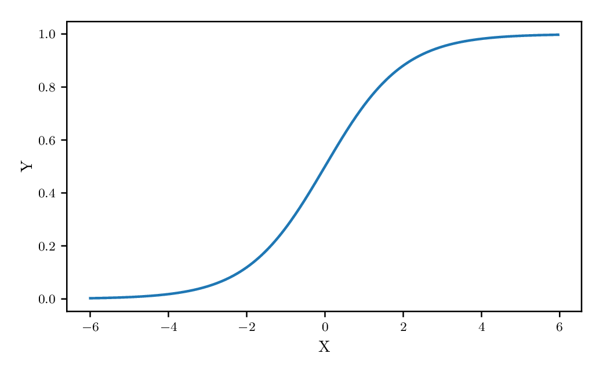

# xam [](https://travis-ci.org/MaxHalford/xam)

xam is my personal data science and machine learning toolbox. It is written in Python 3 and built around mainstream libraries such as pandas and scikit-learn.


<!-- Table of Contents generated by [gotoc](https://github.com/axelbellec/gotoc) -->
<!-- START gotoc -->
**Table of Contents**
  - [Installation](#installation)
  - [Other Python data science and machine learning toolkits](#other-python-data-science-and-machine-learning-toolkits)
  - [Usage examples](#usage-examples)
    - [Clustering](#clustering)
    - [Feature selection](#feature-selection)
    - [Linear models](#linear-models)
    - [Model selection](#model-selection)
    - [Model stacking](#model-stacking)
    - [Natural Language Processing (NLP)](#natural-language-processing-nlp)
    - [Pipeline](#pipeline)
    - [Plotting](#plotting)
    - [Preprocessing](#preprocessing)
      - [Binning](#binning)
      - [Subsampling](#subsampling)
    - [Splitting](#splitting)
    - [Time series analysis (TSA)](#time-series-analysis-tsa)
    - [Various](#various)
  - [License](#license)
<!-- END gotoc -->


## Installation

- [Install Anaconda for Python 3.x](https://www.continuum.io/downloads)
- Run `pip install git+https://github.com/MaxHalford/xam --upgrade` in a terminal


## Other Python data science and machine learning toolkits

- [Laurae2/Laurae](https://github.com/Laurae2/Laurae)
- [rasbt/mlxtend](https://github.com/rasbt/mlxtend)
- [reiinakano/scikit-plot](https://github.com/reiinakano/scikit-plot)
- [scikit-learn-contrib](https://github.com/scikit-learn-contrib)
- [zygmuntz/phraug2](https://github.com/zygmuntz/phraug2)

## Usage examples

The following snippets serve as documentation, examples and tests - through the use of [doctests](https://pymotw.com/2/doctest/). Again, this is for my personal use so the documentation is not very detailed.


### Clustering

**Cross-chain algorithm**

This is a clustering algorithm I devised at one of my internships for matching customers with multiple accounts. The idea was to that if there accounts shared some information - eg. the phone number - then we would count those accounts as one single customer. In the following example, the first customer has three accounts; the first account shares the first variable with the second and the second account shares the second variable with the third. The first and third account share no information but they are linked by the second account and form a chain, hence the name of the algorithm.

```python
>>> import numpy as np
>>> import xam

>>> X = np.array([
...     # First expected cluster
...     [0, 1],
...     [0, 2],
...     [1, 2],
...     # Third expected cluster
...     [4, 3],
...     # Second expected cluster
...     [3, 4],
...     [2, 4],
... ])

>>> xam.clustering.CrossChainClusterer().fit_predict(X)
[0, 0, 0, 1, 2, 2]

```


### Feature selection

**Feature importance**

The `feature_importance` method returns two dataframes that contain feature importance metrics that depend on the types of the feature/target

| Feature/Task         | Classification         | Regression          |
|----------------------|------------------------|---------------------|
| Categorical          | Chi²-test + Cramér's V | F-test              |
| Numerical            | F-test                 | Pearson correlation |

Additionally [mutual information](https://www.wikiwand.com/en/Mutual_information) can be used in each case.

- [Comparison of F-test and mutual information](http://scikit-learn.org/stable/auto_examples/feature_selection/plot_f_test_vs_mi.html)

Classification.

```python
>>> import pandas as pd
>>> from sklearn import datasets
>>> import xam

>>> iris = datasets.load_iris()
>>> features = pd.DataFrame(iris.data, columns=iris.feature_names)
>>> features['sepal length (cm)'] = features['sepal length (cm)'] > 5.5
>>> target = pd.Series(iris.target)

>>> cont_imp, disc_imp = xam.feature_selection.feature_importance_classification(features, target, random_state=1)

>>> cont_imp.sort_values('f_p_value')
                   f_statistic     f_p_value  mutual_information
petal length (cm)  1179.034328  3.051976e-91            0.990061
petal width (cm)    959.324406  4.376957e-85            0.977279
sepal width (cm)     47.364461  1.327917e-16            0.256295

>>> disc_imp.sort_values('chi2_p_value')
                   chi2_statistic  chi2_p_value  cramers_v  mutual_information
sepal length (cm)        98.11883  4.940452e-22   0.803139            0.386244

```

Regression.

```python
>>> import pandas as pd
>>> from sklearn import datasets
>>> import xam

>>> boston = datasets.load_boston()
>>> features = pd.DataFrame(boston.data, columns=boston.feature_names)
>>> features['CHAS'] = features['CHAS'].astype(int)
>>> target = pd.Series(boston.target)

>>> cont_imp, disc_imp = xam.feature_selection.feature_importance_regression(features, target, random_state=1)

>>> cont_imp.sort_values('pearson_r_p_value')
         pearson_r  pearson_r_p_value  mutual_information
LSTAT    -0.737663       5.081103e-88            0.666882
RM        0.695360       2.487229e-74            0.526456
PTRATIO  -0.507787       1.609509e-34            0.453291
INDUS    -0.483725       4.900260e-31            0.471507
TAX      -0.468536       5.637734e-29            0.363694
NOX      -0.427321       7.065042e-24            0.456947
CRIM     -0.385832       2.083550e-19            0.334339
RAD      -0.381626       5.465933e-19            0.217623
AGE      -0.376955       1.569982e-18            0.311285
ZN        0.360445       5.713584e-17            0.195153
B         0.333461       1.318113e-14            0.161861
DIS       0.249929       1.206612e-08            0.295207

>>> disc_imp.sort_values('mutual_information')
      f_statistic  f_p_value  mutual_information
CHAS    15.971512   0.000074            0.030825

```


### Linear models

**AUC regressor**

This is the [AUC regressor](https://github.com/pyduan/amazonaccess/blob/f8addfefcee80f0ca15e416954af3926f3007d16/helpers/ml.py#L77) Paul Duan used for his winning solution to the [Amazon Employee Access Challenge](https://www.kaggle.com/c/amazon-employee-access-challenge).

```python
>>> from sklearn import datasets
>>> from sklearn import metrics
>>> from sklearn import model_selection
>>> import xam

>>> X, y = datasets.load_digits(n_class=2, return_X_y=True)
>>> X_train, X_test, y_train, y_test = model_selection.train_test_split(X, y, train_size=0.5, random_state=42)

>>> model = xam.linear_model.AUCRegressor()
>>> model.fit(X_train, y_train)

>>> train_score = metrics.roc_auc_score(y_train, model.predict(X_train))
>>> test_score = metrics.roc_auc_score(y_test, model.predict(X_test))

>>> print('Train score: {:.3f}'.format(train_score))
Train score: 1.000

>>> print('Test score: {:.3f}'.format(test_score))
Test score: 0.999

```


### Model selection

**Datetime cross-validation**

```python
>>> import datetime as dt
>>> import pandas as pd
>>> import xam

>>> df = pd.DataFrame(
...     [1, 2, 3, 4, 5, 6],
...     index=[
...         dt.datetime(2016, 5, 1),
...         dt.datetime(2016, 5, 1),
...         dt.datetime(2016, 5, 2),
...         dt.datetime(2016, 5, 2),
...         dt.datetime(2016, 5, 2),
...         dt.datetime(2016, 5, 3),
...     ]
... )

>>> df
            0
2016-05-01  1
2016-05-01  2
2016-05-02  3
2016-05-02  4
2016-05-02  5
2016-05-03  6

>>> cv = xam.model_selection.DatetimeCV(timedelta=dt.timedelta(days=1))

>>> for train_idxs, test_idxs in cv.split(df):
...     print(train_idxs, test_idxs)
[0 1] [2 3 4]
[0 1 2 3 4] [5]

```


### Model stacking

- [A Kaggler's guide to model stacking in practice](http://blog.kaggle.com/2016/12/27/a-kagglers-guide-to-model-stacking-in-practice/)
- [Stacking Made Easy: An Introduction to StackNet by Competitions Grandmaster Marios Michailidis](http://blog.kaggle.com/2017/06/15/stacking-made-easy-an-introduction-to-stacknet-by-competitions-grandmaster-marios-michailidis-kazanova/)
- [Stacked generalization, when does it work?](http://www.cs.waikato.ac.nz/~ihw/papers/97KMT-IHW-Stacked.pdf)

**Classification**

```python
>>> from sklearn import datasets, metrics, model_selection
>>> from sklearn.ensemble import RandomForestClassifier
>>> from sklearn.linear_model import LogisticRegression
>>> from sklearn.naive_bayes import GaussianNB
>>> from sklearn.neighbors import KNeighborsClassifier
>>> import xam

>>> iris = datasets.load_iris()
>>> X, y = iris.data[:, 1:3], iris.target

>>> models = {
...     'KNN': KNeighborsClassifier(n_neighbors=1),
...     'Random forest': RandomForestClassifier(random_state=1),
...     'Naïve Bayes': GaussianNB()
... }

>>> stack = xam.stacking.StackingClassifier(
...     models=models,
...     meta_model=LogisticRegression(),
...     use_base_features=True,
...     use_proba=True
... )

>>> for name, model in dict(models, **{'Stacking': stack}).items():
...     scores = model_selection.cross_val_score(model, X, y, cv=3, scoring='accuracy')
...     print('Accuracy: %0.3f (+/- %0.3f) [%s]' % (scores.mean(), 1.96 * scores.std(), name))
Accuracy: 0.913 (+/- 0.016) [KNN]
Accuracy: 0.914 (+/- 0.126) [Random forest]
Accuracy: 0.921 (+/- 0.052) [Naïve Bayes]
Accuracy: 0.954 (+/- 0.079) [Stacking]

```

**Regression**

Model stacking for regression as described in this [Kaggle blog post](http://blog.kaggle.com/2016/12/27/a-kagglers-guide-to-model-stacking-in-practice/).

```python
>>> from sklearn import datasets, model_selection
>>> from sklearn.ensemble import RandomForestRegressor
>>> from sklearn.linear_model import LinearRegression
>>> from sklearn.linear_model import Ridge
>>> from sklearn.neighbors import KNeighborsRegressor
>>> import xam

>>> boston = datasets.load_boston()
>>> X, y = boston.data, boston.target

>>> models = {
...     'KNN': KNeighborsRegressor(n_neighbors=1),
...     'Linear regression': LinearRegression(),
...     'Ridge regression': Ridge(alpha=.5)
... }

>>> stack = xam.stacking.StackingRegressor(
...     models=models,
...     meta_model=RandomForestRegressor(random_state=1),
...     cv=model_selection.KFold(n_splits=10),
...     use_base_features=True
... )

>>> for name, model in dict(models, **{'Stacking': stack}).items():
...     scores = model_selection.cross_val_score(model, X, y, cv=5, scoring='neg_mean_absolute_error')
...     print('MAE: %0.3f (+/- %0.3f) [%s]' % (-scores.mean(), 1.96 * scores.std(), name))
MAE: 7.338 (+/- 1.423) [KNN]
MAE: 4.257 (+/- 1.923) [Linear regression]
MAE: 4.118 (+/- 1.971) [Ridge regression]
MAE: 3.234 (+/- 1.089) [Stacking]

```


### Natural Language Processing (NLP)

**Top-terms classifier**

```python
>>> from sklearn.datasets import fetch_20newsgroups
>>> from sklearn.feature_extraction.text import CountVectorizer
>>> import xam

>>> cats = ['alt.atheism', 'comp.windows.x']
>>> newsgroups_train = fetch_20newsgroups(subset='train', categories=cats)
>>> newsgroups_test = fetch_20newsgroups(subset='test', categories=cats)

>>> vectorizer = CountVectorizer(stop_words='english', max_df=0.2)

>>> X_train = vectorizer.fit_transform(newsgroups_train.data)
>>> y_train = newsgroups_train.target

>>> X_test = vectorizer.transform(newsgroups_test.data)
>>> y_test = newsgroups_test.target

>>> clf = xam.nlp.TopTermsClassifier(n_terms=50)
>>> clf.fit(X_train.toarray(), y_train).score(X_test.toarray(), y_test)
0.95238095238095233

```


### Pipeline


**Column selection**

Transformer that extracts one or more columns from a dataframe; is useful for applying a Transformer on a subset of features in a pipeline.

```python
>>> import pandas as pd
>>> import xam

>>> df = pd.DataFrame({'a': [1, 1, 1], 'b': [2, 2, 2], 'c': [3, 3, 3]})

>>> xam.preprocessing.ColumnSelector('a').fit_transform(df)
0    1
1    1
2    1
Name: a, dtype: int64

>>> xam.preprocessing.ColumnSelector(['b', 'c']).fit_transform(df)
   b  c
0  2  3
1  2  3
2  2  3

```


**Series transformer**

Applies a function to each value in series.

```python
>>> import pandas as pd
>>> from sklearn.pipeline import Pipeline
>>> from xam.preprocessing import ColumnSelector
>>> from xam.preprocessing import SeriesTransformer

>>> df = pd.DataFrame({'a': [1, 1, 1], 'b': [2, 2, 2]})

>>> pipeline = Pipeline([
...    ('extract', ColumnSelector('a')),
...    ('transform', SeriesTransformer(lambda x: 2 * x))
... ])

>>> pipeline.fit_transform(df)
0    2
1    2
2    2
Name: a, dtype: int64

```


**Convert to DataFrame transformer**

By design scikit-learn Transformers output numpy nd-arrays, the `ToDataFrameTransformer` can be used in a pipeline to return pandas dataframes if needed.

```python
>>> import pandas as pd
>>> from sklearn.pipeline import Pipeline
>>> from xam.preprocessing import ColumnSelector
>>> from xam.preprocessing import SeriesTransformer
>>> from xam.preprocessing import ToDataFrameTransformer

>>> df = pd.DataFrame({'a': [1, 1, 1], 'b': [2, 2, 2]})

>>> pipeline = Pipeline([
...    ('extract', ColumnSelector('a')),
...    ('transform', SeriesTransformer(lambda x: 2 * x)),
...    ('dataframe', ToDataFrameTransformer())
... ])

>>> pipeline.fit_transform(df)
   a
0  2
1  2
2  2

```


**Lambda transformer**

Will apply a function to the input; this transformer can potentially do anything but you have to keep track of your inputs and outputs. Alternatively you can use scikit-learn's [`FunctionTransformer`](http://scikit-learn.org/stable/modules/generated/sklearn.preprocessing.FunctionTransformer.html) but this only works for numpy arrays, not pandas dataframes.

```python
>>> import pandas as pd
>>> import xam

>>> df = pd.DataFrame({'one': ['a', 'a', 'a'], 'two': ['c', 'a', 'c']})

>>> def has_one_c(dataframe):
...    return (dataframe['one'] == 'c') | (dataframe['two'] == 'c')

>>> xam.preprocessing.LambdaTransfomer(has_one_c).fit_transform(df)
0     True
1    False
2     True
dtype: bool

```


### Plotting

**Latex style figures**

```python
>>> from xam import latex  # Has to be imported before matplotlib.pyplot
>>> import numpy as np

>>> fig, ax = latex.new_fig(width=0.8)

>>> x = np.arange(-2, 2, 0.03)
>>> y1 = 1 / (1 + np.exp(-x))
>>> y2 = np.tanh(x)
>>> y3 = np.arctan(x)
>>> y4 = x * (x > 0)

>>> plot = ax.plot(x, y1, label='Logistic sigmoid')
>>> plot = ax.plot(x, y2, label='Hyperbolic tangent')
>>> plot = ax.plot(x, y3, label='Inverse tangent')
>>> plot = ax.plot(x, y4, label='Rectified linear unit (ReLU)')

>>> x_label = ax.set_xlabel(r'$x$')
>>> y_label = ax.set_ylabel(r'$y$')
>>> title = ax.set_title('A few common activation functions')
>>> ax.grid(linewidth=0.5)
>>> legend = ax.legend(loc='upper left', framealpha=1)

latex.save_fig('figures/latex_example')

```

<div align="center">
  
</div>


### Preprocessing

**Conditional imputation**

Scikit-learn's [`Imputer`](http://scikit-learn.org/stable/modules/generated/sklearn.preprocessing.Imputer.html) transformer is practical for it is an unsupervised method. `ConditionalImputer` makes it possible to apply an `Imputer` in a supervised way. In other words the `Imputer` is applied conditionally on the value of `y`.

```python
>>> import numpy as np
>>> from sklearn.preprocessing import Imputer
>>> import xam

>>> X = np.array([
...     [1,      4,      1],
...     [np.nan, np.nan, 1],
...     [3,      5,      1],
...     [3,      5,      2],
...     [3,      np.nan, 2],
...     [3,      7,      2],
... ])

>>> imp = xam.preprocessing.ConditionalImputer(groupby_col=2, strategy='mean')
>>> imp.fit_transform(X)
array([[ 1. ,  4. ],
       [ 2. ,  4.5],
       [ 3. ,  5. ],
       [ 3. ,  5. ],
       [ 3. ,  6. ],
       [ 3. ,  7. ]])

```


**Transforming cyclic**

Day of week, hours, minutes, are cyclic ordinal features; cosine and sine transforms should be used to express the cycle. See [this StackEchange discussion](https://datascience.stackexchange.com/questions/5990/what-is-a-good-way-to-transform-cyclic-ordinal-attributes). This transformer returns an array with twice as many columns as the input array; the first columns are the cosine transforms and the last columns are the sine transforms.

```python
>>> import numpy as np
>>> import xam

>>> times = np.array([
...    np.linspace(0, 23, 4),
...    np.linspace(0, 59, 4),
... ]).T

>>> trans = xam.preprocessing.CycleTransformer()
>>> trans.fit_transform(times)
array([[ 1.        ,  1.        ,  0.        ,  0.        ],
       [-0.42261826, -0.46947156,  0.90630779,  0.88294759],
       [-0.64278761, -0.5591929 , -0.76604444, -0.82903757],
       [ 0.96592583,  0.9945219 , -0.25881905, -0.10452846]])

```


#### Binning

**Bayesian blocks binning**

Heuristically determines the number of bins to use for continuous variables, see this [blog post](https://jakevdp.github.io/blog/2012/09/12/dynamic-programming-in-python/) for details.

```python
>>> import numpy as np
>>> from scipy import stats
>>> import xam

>>> np.random.seed(0)
>>> x = np.concatenate([
...     stats.cauchy(-5, 1.8).rvs(500),
...     stats.cauchy(-4, 0.8).rvs(2000),
...     stats.cauchy(-1, 0.3).rvs(500),
...     stats.cauchy(2, 0.8).rvs(1000),
...     stats.cauchy(4, 1.5).rvs(500)
... ])
>>> x = x[(x > -15) & (x < 15)].reshape(-1, 1)
>>> binner = xam.preprocessing.BayesianBlocksBinner()
>>> binner.fit_transform(X=x)[:10]
array([[ 6],
       [ 8],
       [ 7],
       [ 6],
       [ 5],
       [ 7],
       [ 5],
       [13],
       [20],
       [ 4]])

```

**Equal frequency binning**

Transformer that bins continuous data into `n_bins` of equal frequency.

```python
>>> import numpy as np
>>> import xam

>>> np.random.seed(42)
>>> mu, sigma = 0, 0.1
>>> x = np.random.normal(mu, sigma, 10).reshape(-1, 1)

>>> binner = xam.preprocessing.EqualFrequencyBinner(n_bins=5)
>>> binner.fit_transform(X=x)
array([[2],
       [1],
       [3],
       [4],
       [0],
       [1],
       [4],
       [3],
       [0],
       [2]])

```

**Equal width binning**

Transformer that bins continuous data into `n_bins` of equal width.

```python
>>> import numpy as np
>>> import xam

>>> np.random.seed(42)
>>> mu, sigma = 0, 0.1
>>> x = np.random.normal(mu, sigma, 10).reshape(-1, 1)

>>> binner = xam.preprocessing.EqualWidthBinner(n_bins=5)
>>> binner.fit_transform(X=x)
array([[2],
       [0],
       [2],
       [4],
       [0],
       [0],
       [5],
       [3],
       [0],
       [2]])

```

**Minimum Description Length Principle (MDLP) binning**

```python
>>> from sklearn import datasets
>>> import xam

>>> iris = datasets.load_iris()
>>> X, y = iris.data[:, 1:3], iris.target

>>> binner = xam.preprocessing.MDLPBinner()
>>> binner.fit_transform(X, y)[:10]
array([[2, 0],
       [1, 0],
       [1, 0],
       [1, 0],
       [2, 0],
       [2, 0],
       [2, 0],
       [2, 0],
       [0, 0],
       [1, 0]])

```

#### Subsampling

See this [blog post](https://maxhalford.github.io/subsampling-1/).

```python
>>> import numpy as np
>>> import scipy as sp
>>> import xam

>>> np.random.seed(0)
>>> train = np.random.beta(1.5, 2, size=5000)
>>> test = np.random.beta(2, 1.5, size=1000)

>>> # Calculate Kullback–Leibler divergence between the train and the test data
>>> sp.stats.entropy(np.histogram(train, bins=30)[0], np.histogram(test, bins=30)[0])
0.1612937324333199

>>> resampler = xam.preprocessing.DistributionSubsampler(feature=0, sample_frac=0.5, seed=0)
>>> resampler.fit(test.reshape(-1, 1))

>>> sample = resampler.transform(train.reshape(-1, 1))

>>> # The Kullback–Leibler divergence between sample and test is now lower
>>> sp.stats.entropy(np.histogram(sample, bins=30)[0], np.histogram(test, bins=30)[0])
0.036151910003416353

```


### Splitting

Splitting makes it easy a model on different *splits* of a dataset. For example you may want to train one model per user/day.

:warning: Python doesn't know how to pickle lambda functions; you should pass a plain old `def` function to `SplittingEstimator` if you want to be able to pickle it.

```python
>>> from sklearn import model_selection
>>> from sklearn.linear_model import Lasso
>>> from sklearn.datasets import load_diabetes
>>> import xam

>>> X, y = load_diabetes(return_X_y=True)

>>> def split(row):
...    return row[1] > 0

>>> lasso = Lasso(alpha=0.01, random_state=42)
>>> split_lasso = xam.splitting.SplittingEstimator(lasso, split)

>>> cv = model_selection.KFold(n_splits=5, random_state=42)

>>> scores = model_selection.cross_val_score(lasso, X, y, cv=cv, scoring='r2')
>>> print('{:.3f} (+/- {:.3f})'.format(scores.mean(), 1.96 * scores.std()))
0.481 (+/- 0.095)

>>> scores = model_selection.cross_val_score(split_lasso, X, y, cv=cv, scoring='r2')
>>> print('{:.3f} (+/- {:.3f})'.format(scores.mean(), 1.96 * scores.std()))
0.496 (+/- 0.098)

```


### Time series analysis (TSA)

**Exponential smoothing forecasting**

```python
>>> import datetime as dt
>>> import numpy as np
>>> import pandas as pd
>>> import xam

>>> df = pd.read_csv('datasets/airline-passengers.csv')
>>> series = pd.Series(
...     data=df['passengers'].tolist(),
...     index=pd.DatetimeIndex([dt.datetime.strptime(m, '%Y-%m') for m in df['month']]),
...     dtype=np.float
... )

>>> # Determine how long a season lasts (in this case twelve months)
>>> season_length = 12

>>> # Train/test split
>>> train_test_split_index = 12 # Forecast the last year
>>> train = series[:-train_test_split_index]
>>> test = series[-train_test_split_index:]

>>> # Learning coefficients
>>> alpha = 0.1
>>> beta = 0.2
>>> gamma = 0.6

>>> xam.tsa.SimpleExponentialSmoothingForecaster(alpha).fit(train).predict(test.index)
1960-01-01    415.452445
1960-02-01    414.407201
1960-03-01    413.466481
1960-04-01    412.619833
1960-05-01    411.857849
1960-06-01    411.172064
1960-07-01    410.554858
1960-08-01    409.999372
1960-09-01    409.499435
1960-10-01    409.049491
1960-11-01    408.644542
1960-12-01    408.280088
dtype: float64

>>> xam.tsa.DoubleExponentialSmoothingForecaster(alpha, beta).fit(train).predict(test.index)
1960-01-01    447.564520
1960-02-01    451.786035
1960-03-01    456.007549
1960-04-01    460.229064
1960-05-01    464.450579
1960-06-01    468.672094
1960-07-01    472.893609
1960-08-01    477.115124
1960-09-01    481.336638
1960-10-01    485.558153
1960-11-01    489.779668
1960-12-01    494.001183
dtype: float64

>>> xam.tsa.TripleExponentialSmoothingForecaster(
...     alpha,
...     beta,
...     gamma,
...     season_length=season_length,
...     multiplicative=True
... ).fit(train).predict(test.index)
1960-01-01    407.899644
1960-02-01    389.067806
1960-03-01    458.415393
1960-04-01    448.046660
1960-05-01    471.033884
1960-06-01    543.653030
1960-07-01    623.363220
1960-08-01    634.072374
1960-09-01    525.714489
1960-10-01    462.219296
1960-11-01    407.274166
1960-12-01    452.141880
dtype: float64

```

**Frequency average forecasting**

```python
>>> import datetime as dt
>>> import pandas as pd
>>> import xam

>>> df = pd.read_csv('datasets/bike-station.csv')
>>> series = pd.Series(
...     data=df['bikes'].tolist(),
...     index=pd.to_datetime(df['moment'], format='%Y-%m-%d %H:%M:%S')
... )

>>> forecaster = xam.tsa.FrequencyAverageForecaster(lambda d: f'{d.weekday()}-{d.hour}')
>>> forecaster.fit(series[:-10]).predict(series.index[-10:])
moment
2016-10-05 09:28:48    8.622535
2016-10-05 09:32:34    8.622535
2016-10-05 09:40:55    8.622535
2016-10-05 09:42:34    8.622535
2016-10-05 09:45:06    8.622535
2016-10-05 09:46:29    8.622535
2016-10-05 09:50:54    8.622535
2016-10-05 09:53:00    8.622535
2016-10-05 09:54:04    8.622535
2016-10-05 09:57:18    8.622535
dtype: float64

```


### Various

**Datetime range**

```python
>>> import datetime as dt
>>> import xam

>>> since = dt.datetime(2017, 3, 22)
>>> until = dt.datetime(2017, 3, 25)
>>> step = dt.timedelta(days=2)

>>> dt_range = xam.util.datetime_range(since=since, until=until, step=step)
>>> for dt in dt_range:
...     print(dt)
2017-03-22 00:00:00
2017-03-24 00:00:00

```

**Next day of the week**

```python
>>> import datetime as dt
>>> import xam

>>> now = dt.datetime(2017, 3, 22) # Wednesday
>>> next_monday = xam.util.get_next_weekday(now, 0) # Get next Monday
>>> next_monday
datetime.datetime(2017, 3, 27, 0, 0)

```

**Subsequence lengths**

```python
>>> import xam

>>> sequence = 'appaaaaapa'
>>> lengths = xam.util.subsequence_lengths(sequence)
>>> print(lengths)
{'a': [1, 5, 1], 'p': [2, 1, 2]}

>>> averages = {k: sum(v) / len(v) for k, v in lengths.items()}
>>> print(averages)
{'a': 2.3333333333333335, 'p': 1.6666666666666667}

```

**Convert pandas DataFrame to Vowpal Wabbit format**

`xam.util.dataframe_to_vw` convert a `pandas.DataFrame` to a string which can be ingested by [Vowpal Wabbit](https://github.com/JohnLangford/vowpal_wabbit) once it is saved on disk.

```python
>>> import xam

>>> df = pd.DataFrame.from_dict({
...     'label': [0, 0, 1, 1],
...     'feature_0': [0.2, 0.1, 0.4, 0.3],
...     'feature_1': [0.4, 0.3, 0.3, 0.2],
... })

>>> vw_str = xam.util.dataframe_to_vw(df, label_col='label')
>>> print(vw_str)
0 | feature_0:0.2 feature_1:0.4
0 | feature_0:0.1 feature_1:0.3
1 | feature_0:0.4 feature_1:0.3
1 | feature_0:0.3 feature_1:0.2

```

## License

The MIT License (MIT). Please see the [license file](LICENSE) for more information.
